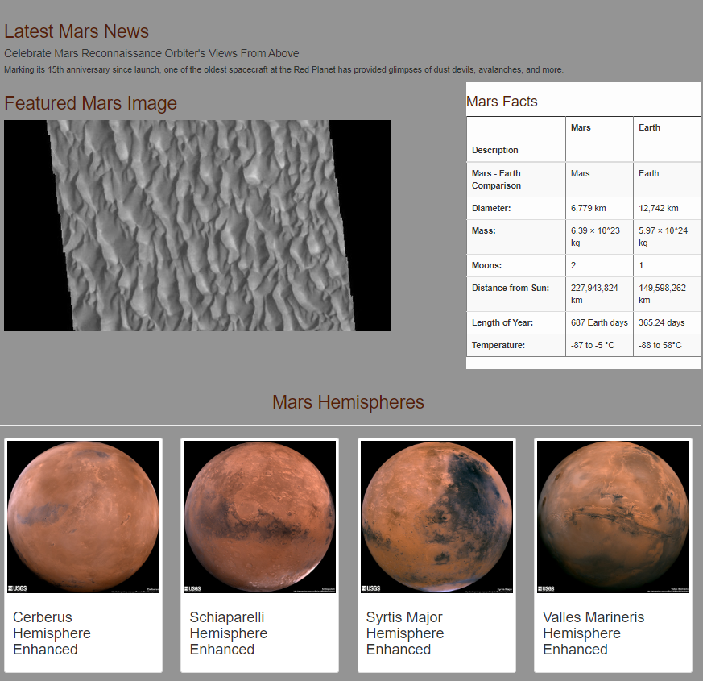

# Web Scrape of Mars Information Using Python, HTML, CSS

## Overview

This project involved web scraping multiple reputable websites to gather Mars related information and images. The Python libraries (Beautiful Soup, Splinter, Pandas, Flask) were all required to this task. The information and images were then stored and displayed via a web application which was created using Flask. The code was written in a way for the user to click a button (Picured above), which will return the most up to date Mars related data and display it.

### Mars News

The script visits the [Red Planet Science Website](https:/redplanetscience.com) and scrapes the most recent headline which will then be featured on the web applications. 

### Mars Image

The script visits the [Space Images-Mars Website](https://spaceimages-mars.com) and scrapes the current featured image.

### Mars Facts

The script visits the [Galaxy Facts Website](https://galaxyfacts-mars.com) and scrapes the Mars facts. The facts are loaded in to a dataframe and then converted to HTML. 

### Mars Hemispheres

The script visits [Mars Hemispheres Website](https://marshemispheres.com/) and scrapes the name of each hemisphere as well as a full-resolution image. 

